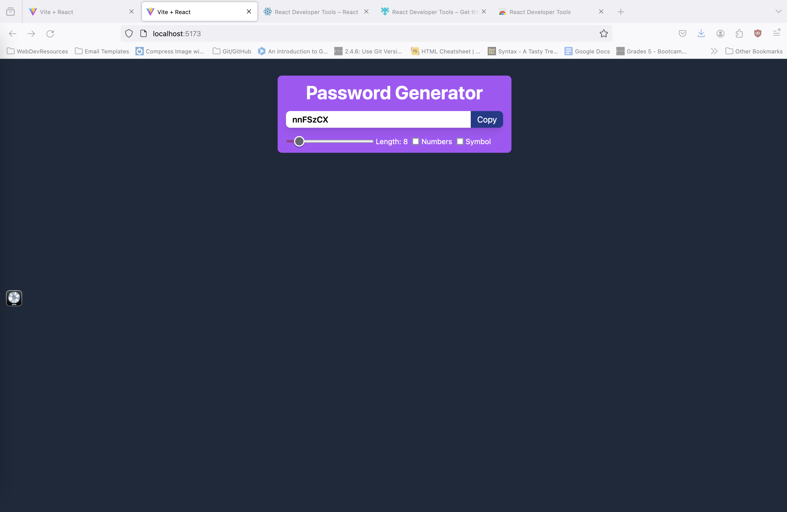

# PasswordGenerator

## React + Vite
## Description

A simple password generator app created using React 
The Ui is simple and intuitive alowing user to set:
length using a range from 8 - 24 and unclude number and special characters! 

- What was your motivation?\
The motivation for this app was to practice some of the React hooks hooks used regulary on larger code bases ie useState, useCallback, useEffect, useRef

- Why did you build this project?\
Building this project alowed me to get a deeper understanding of the mentioned hooks above

- What problem does it solve?\
This project solves 2 main things, for a user, it alows then to create a secure password that is automatically generated depending on the dependancies they select.
secondaly for me it alows me to get a better understanding of the hooks used

- What did you learn?\
I learned that useEffect alows a piece of code to run at least once, but by providing a dependancy array this code will run anytime the dependancy changes.
It also alows an optional implementation of a cleanup fuction in the return function

## Usage

[Deployed Site]( https://timatoyo.github.io/reactPasswordGenerator/)

    
    
    

## Credits

[FreeCodeCamp Youtube](https://www.youtube.com/watch?v=Bvwq_S0n2pk&t=11650s) 
## License

